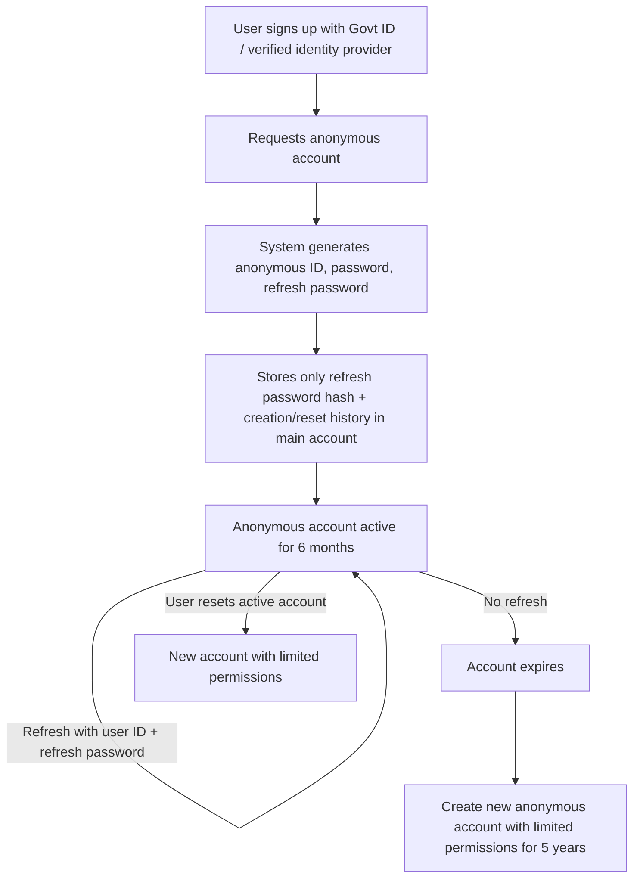

# snich-stich
Let's make sure that snitches don't get stitches.

 ### Basic idea 💡
1. User signs up with a govt id or a similar identity provider to prevent multiple sign ups per user.
2. User can request an anonymous account upon which a new account Id, password and a refresh password is generated. The refresh password hash is stored in the original account along with a count for the number of times a new account was created and reset and the dates of creation and deletions. The other credentials are never stored in the original/public account.
3. Once an anonymous account is created it by default becomes inaccessible after 6 months unless the original account requests a refresh using the user id and refresh password.
4. The user is allowed to refresh the anonymous account any number of times to extend its validity for another six months till the validity expires if the user does not refresh during that period.
5. Once the validity of an anonymous account is expired then the user must create a new anonymous account which will have limited permissions for 5 years including not allowed to up vote or down vote but can post, comment and text other users.
6. If a user needs to reset the anonymous account while it is still active, the current anonymous account cannot be refreshed again and the new account will also have limited permissions.
7. The dates are not stored in the anonymous account so after 5 years the anonymous account has to use the refresh password to request voting permissions. 

# Whitepaper

## Overview
This document outlines a unique system for creating and managing **anonymous accounts** that allow users to participate in public discussions without linking their activities to their main identity, while ensuring that **each user can have only one anonymous account** at a time.

The system is designed to balance:
- **Privacy**: Activities of the anonymous account cannot be traced back to the main account.
- **Fairness**: Prevents users from creating multiple anonymous accounts to manipulate votes or discussions.
- **Accountability**: Tracks the creation, deletion, and refresh history without storing sensitive anonymous credentials in the main account.

---

## Flow Chart

---

## Step-by-Step Explanation

1. Verified Sign-Up

The user signs up with a government-issued ID or a trusted identity provider (e.g., bank KYC, national ID verification).

Purpose: Prevent users from creating multiple main accounts and ensures each real person is unique in the system.

Use Case Example:
Alice joins the platform and verifies her identity with her passport. The system confirms she is unique.

---

2. Requesting an Anonymous Account

The user can request an anonymous account.

Upon request, the system:

Generates a new anonymous account ID.

Creates a password and a refresh password.

Stores only the refresh password hash in the main account, along with:

Number of times the anonymous account was created or reset.

Dates of creation and deletion.

No other anonymous account credentials are stored in the main account.

Use Case Example:
Alice wants to participate in heated political discussions without linking them to her public profile. She requests an anonymous account.

---

3. Anonymous Account Validity

The account is valid for 6 months by default.

The user can refresh the account before it expires by:

Providing their main account ID.

Providing their refresh password.

Each refresh extends the validity for another 6 months.

Use Case Example:
Alice keeps using her anonymous account to discuss mental health topics. She refreshes it every few months to keep it active.

---

4. Expiration of Anonymous Account

If the user does not refresh the account within the validity period:

The account expires.

The user can create a new anonymous account but with limited permissions for 5 years:

Cannot upvote or downvote posts.

Can post, comment, and message other users.

Use Case Example:
Alice forgets to refresh her anonymous account. She creates a new one but can’t vote on content for the next 5 years.

---

5. Resetting While Active

If the user resets an anonymous account while it is still active:

The current account becomes non-refreshable.

The new account is created with limited permissions for 5 years.

Use Case Example:
Bob wants a completely new anonymous identity while his current one is still active. He resets it, but now loses voting rights for 5 years.

---

Benefits

1. Prevents Sockpuppeting
Eliminates the possibility of creating multiple fake anonymous accounts to manipulate votes or discussions.

2. Encourages Accountability Without Compromising Privacy
Users are free to speak their minds without fear of being linked to their public identity, while still following platform rules.

3. Manages Abuse and Spam
Limited permissions for repeated account resets or expired accounts discourage abuse.

4. Enables Long-Term Anonymity
As long as the user refreshes on time, they can maintain a persistent anonymous identity indefinitely.

---

Potential Applications

Political discussions where fear of retaliation discourages open participation.

Whistleblowing platforms where anonymity is essential for safety.

Mental health communities where users want to share without stigma.

Market research where participants provide honest feedback without bias.

---

Conclusion

This system provides a balance between anonymity, fairness, and accountability. By tying anonymous accounts to verified main accounts while strictly limiting the ability to create multiple identities, the platform can maintain trust in votes, comments, and content quality—without compromising user privacy.

